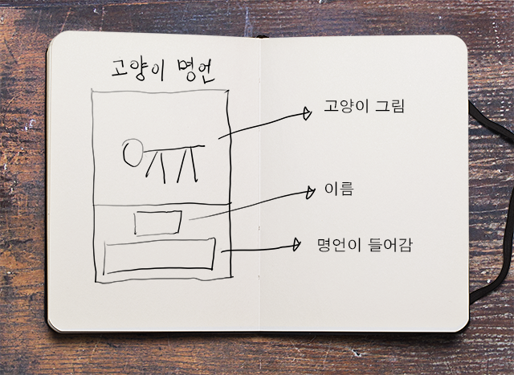
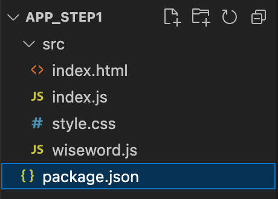
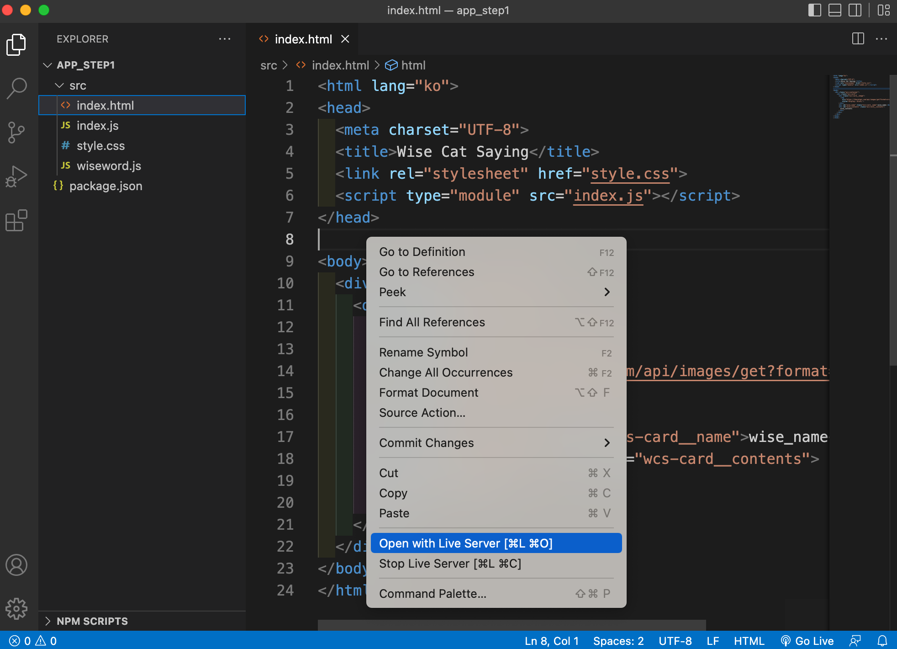
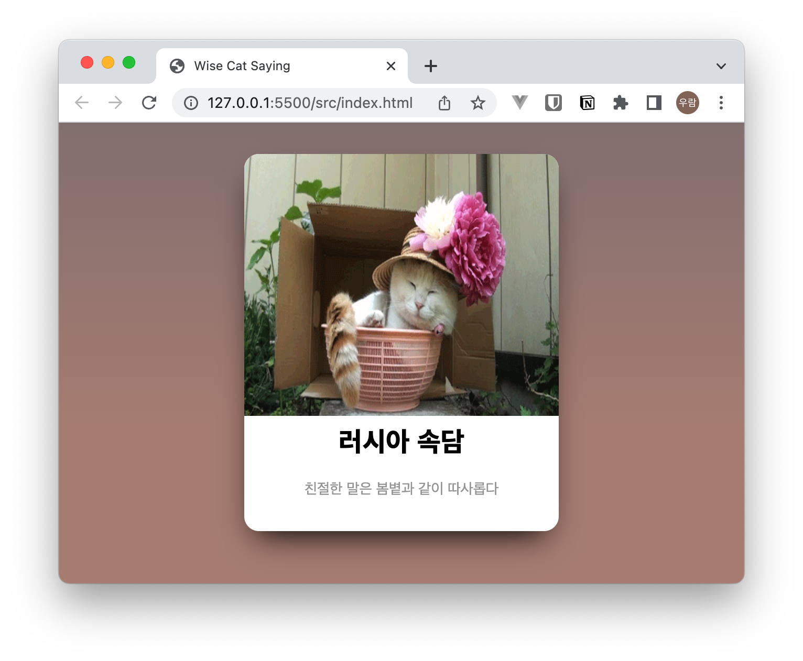

## 연관 게시글

| 단계 | 제목 | 비고 |
|---|:---|---|
| `01.시작하기` | [나만의 자바스크립트 라이브러리 만들기](/2022/my-npm-module-01/) <- 지금 문서 | `old school 버전` |
| `02.배포하기(기본)` | [나만의 자바스크립트 라이브러리 만들기](/2022/my-npm-module-02/) | `old school 버전`  |
| `03.배포하기(모듈)` | [나만의 자바스크립트 라이브러리 만들기](/2022/my-npm-module-03/) | `번들러 이용` |

<br />

---

<br />

## 시작 전 준비물

- node 환경 및 인터넷 환경
- Visual Studio Code
- Javasciprt 선행지식
- node 및 npm 선행지식

<br />

## 1. 시작하기

내가 만든 라이브러리를 다른 사람에게 공유하고 널리 사용되도록 만들어 볼려고 합니다.  
다른 내용은 차후 미루고 먼저 간단한 기능을 가진 컨포넌트를 만들어 봅시다.

### 1.1 예상 이미지



- 카드 모양의 레이아웃에 고양이 그림과 명언 텍스트가 나오도록 할려고 합니다.
- 매번 다른 화면과 다른 텍스트가 나오도록 할려고 합니다.

### 1.2 리소스 구하기

- 이미지 : https://thecatapi.com/
- 명언 : 구글(?)

<br />

## 2. 일단 만들어 보기

- old school 버전으로 만들어 보겠습니다.
- 브라우저에서 바로 실행되는 이전 스타일 HTML, CSS, JAVASCRIPT 를 뜻합니다.

 [위키백과](https://ko.wikipedia.org/wiki/%EC%98%AC%EB%93%9C_%EC%8A%A4%EC%BF%A8) 발췌
>  올드 스쿨(old school)은 이전 시대의 전통적인 형식을 의미하는 영어 단어이다. 올드 스쿨 힙합(Old skool hip hop)은 초기 힙합 음악을 가리키는 장르명이다.


### 2.1 프로젝트 생성

```bash
# [shell]

mkdir myJavascriptLib  # 사용하고자 하는 디렉토리
cd myJavascriptLib # 이동

mkdir app_step1  # old school 버전 앱 디렉토리
cd app_step1 # 이동

# 해당 공간에 노드패키지매니저 초기화 (package.json 생성)
# 특별한 설정 없이 엔터 치면서 진행 완료한 모습
npm init

# src 디렉토리 생성
mkdir src
cd src
```

### 2.2 프로젝트 파일 생성



- index.html, index.js, style.css, wiseword.js 파일을 생성합니다.

<br />

### 2.3 파일 작성 - index.html

```html
<!--
  [source] index.html
--> 

<html lang="ko">
<head>
  <meta charset="UTF-8">
  <title>Wise Cat Saying</title>
  <link rel="stylesheet" href="style.css">
  <script type="module" src="index.js"></script>
</head>

<body>
  <div class="wcs-container">
    <div class="wcs-card">
      <div class="wcs-card__image">
        
      </div>          
      <div id="wise_name" class="wcs-card__name">wise_name</div>
      <div id="wise_contents" class="wcs-card__contents">
        wise_contents
      </div>
    </div>
  </div> 
</body>
</html>
```

### 2.4 파일 작성 - style.css

``` css
/*
 [source] style.css
*/
*, *:before, *:after {
  box-sizing: border-box;
}

body {
  background: linear-gradient(to bottom, rgb(140, 122, 122) 0%, rgb(175, 135, 124) 65%, rgb(175, 135, 124) 100%) fixed;
  background-size: cover;
  font: 14px/20px "Lato", Arial, sans-serif;
  color: #9E9E9E;
  margin-top: 30px;
}

.wcs-container {
  margin: auto;
  width: 600px;
  text-align: center;
}
.wcs-container .wcs-card {
  background: white;
  width: 300px;
  display: inline-block;
  margin: auto;
  border-radius: 14px;
  position: relative;
  text-align: center;
  box-shadow: -1px 15px 30px -12px black;
  z-index: 9999;
}
.wcs-container .wcs-card .wcs-card__image {
  position: relative;
  height: 230px;
  margin-bottom: 35px;
  border-top-left-radius: 14px;
  border-top-right-radius: 14px;
}
.wcs-container .wcs-card .wcs-card__image img {
  position: absolute;
  height: 250px;
  width: 300px;
  border-top-left-radius: 14px;
  border-top-right-radius: 14px;
}
.wcs-container .wcs-card .wcs-card__name {
  font-size: 26px;
  color: black;
  font-weight: 900;
  margin-bottom: 5px;
}
.wcs-container .wcs-card .wcs-card__contents {
  padding: 20px;
  margin-bottom: 10px;
}
```

### 2.5 파일 작성 - index.js

```js
// [source] index.js
import { wiseword } from './wiseword.js'

console.log('wiseword : ', wiseword);

function getRandomInt(min, max) {
  min = Math.ceil(min);
  max = Math.floor(max);
  return Math.floor(Math.random() * (max - min + 1)) + min;
}

const randomWord = wiseword[getRandomInt(0,24)]

document.getElementById('wise_name').textContent = randomWord.name
document.getElementById('wise_contents').textContent = randomWord.contents
```

### 2.6 파일 작성 - wiseword.js

```js
// [source] wiseword.js

export const wiseword = [
  {
    key: 1,
    contents: '운은 마음의 준비가 있는 사람에게만 미소를 짓는다.',
    name: '파스퇴르'    
  },
  {
    key: 2,
    contents: '사랑은 신뢰의 행위다, 믿으니까 믿는 것이다, 사랑하니까 사랑하는 것이다',
    name: '로망롤랑'    
  },
  {
    key: 3,
    contents: '위대함에는 신비성이 필요하다, 너무 알면 사람들은 존경하지 않는다',
    name: '드골',
  },
  {
    key: 4,
    contents: '요구받기 전에 먼저 충고하지 말라',
    name: '에라스무스',
  },
  {
    key: 5,
    contents: '우주를 한 사람으로 축소시키고 그 사람을 신으로 확대시키는 것이 바로 사랑이다',
    name: '빅토르 위고',
  },
  ...
]


```


## 3. 코드 설명

### 3.1 markup 설명
```html
<!--
  [source] index.html
--> 
  ...
  <script type="module" src="index.js"></script>
  ...
```
- 완전히 예전 방식의 프로그램은 아닙니다. `type="module"` 을 이용하여 ES2015(ES6) 지원 형식인 **javascript import/export** 기능을 사용합니다.
- css는 설명을 생략합니다.

  > 참고 링크  
  >  [MDN - javascript modules](https://developer.mozilla.org/en-US/docs/Web/JavaScript/Guide/Modules)  
  >  [MDN - javascript import](https://developer.mozilla.org/ko/docs/Web/JavaScript/Reference/Statements/import)  
  >  [MDN - javascript export](https://developer.mozilla.org/ko/docs/Web/JavaScript/Reference/Statements/export)


### 3.2 javascript 코드

- 먼저 구글링을 통해 찾은 명언을 적당한 구조체 형식으로 **명언사전(wiseword.js)** 을 만들고 import 합니다.

```js
// [source] index.js
import { wiseword } from './wiseword.js'
...
```

- 랜덤 함수를 만들고 매번 새로운 명언 오브젝트를 선택하도록 합니다. 

```js
// [source] index.js
...
function getRandomInt(min, max) {
  min = Math.ceil(min);
  max = Math.floor(max);
  return Math.floor(Math.random() * (max - min + 1)) + min;
}
const randomWord = wiseword[getRandomInt(0,24)]
...
```

- 선택된 명언 오브젝트의 이름과 내용이 마크업에 표시되도록 합니다.

```js
// [source] index.js
...
document.getElementById('wise_name').textContent = randomWord.name
document.getElementById('wise_contents').textContent = randomWord.contents
```


## 3. app 실행

- vscode 의 [Live Server](https://marketplace.visualstudio.com/items?itemName=ritwickdey.LiveServer) 를 이용하여 확인해 볼수 있습니다.



<br />

---



- 다음과 같이 실행됩니다.

<br />

## 4. 다음단계로

- 이제 내가 만든 이 간단한 프로그램을 다른사람들도 사용하도록 하려면 어떻게 해야 할지 고민해 봅시다


```toc

```
