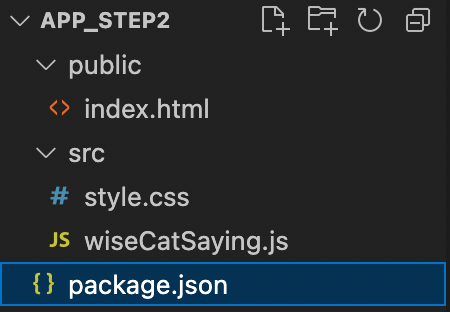
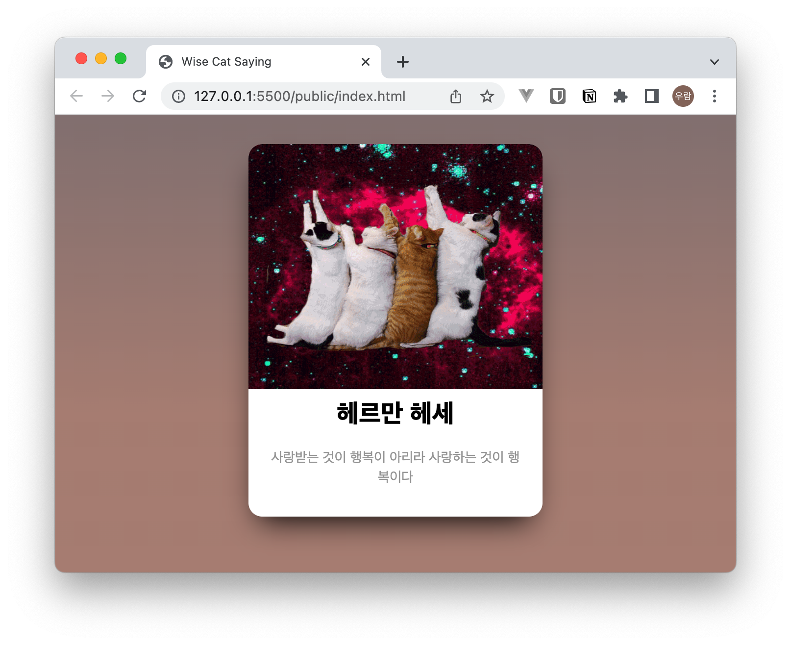

## 연관 게시글

| 단계 | 제목 | 비고 |
|---|:---|---|
| `01.시작하기` | [나만의 자바스크립트 라이브러리 만들기](/2022/my-npm-module-01/) | `old school 버전` |
| `02.배포하기(기본)` | [나만의 자바스크립트 라이브러리 만들기](/2022/my-npm-module-02/) | `old school 버전`  |
| `03.배포하기(모듈)` | [나만의 자바스크립트 라이브러리 만들기](/2022/my-npm-module-03/) <- 지금 문서 | `번들러 이용` |

<br />

---

<br />

## 시작 전 준비물

- node 환경 및 인터넷 환경
- Visual Studio Code
- Javasciprt 선행지식
- node 및 npm 선행지식

<br />

## 1. 시작하기

이전에 만들어 본 **고양이-명언-라이브러리**( [나만의 자바스크립트 라이브러리 만들기](/2022/my-npm-module-01/) ) 를 다른 친구들이 이용하게 하려면 어떻게 해야 할까요

### 1.1 간단한 방법

작성한 코드덩어리를 `zip` 파일로 압축하고 친구들에게   

1. 파일을 전달
2. 필요한 부분을 적당히 카피/복사 하여 사용할 수 있도록 사용법을 전달  

이렇게 하면 될것 같습니다.   
현재 문서에서 진행해 보도록 하겠습니다.


### 1.2 세련된 방법 **

`node_module` 폴더 안에 라이브러리 형태로 들어갈 수 있도록 만들어서 조금 더 편리하게 사용하도록 안내합니다.  
다음 문서에서 진행해 보도록 하겠습니다.


<br />

## 2. 배포용 프로젝트 만들기

- old school 버전으로 만들어 보겠습니다.


### 2.1 프로젝트 생성

```bash
# [shell]

mkdir app_step2  # old school 버전 앱 디렉토리
cd app_step2 # 이동

# 해당 공간에 노드패키지매니저 초기화 (package.json 생성)
# 특별한 설정 없이 엔터 치면서 진행 완료한 모습
npm init

# public 디렉토리 생성
mkdir public

# src 디렉토리 생성
mkdir src
```

### 2.2 프로젝트 파일 생성



- public 폴더를 생성합니다.
  - `index.html` 파일을 생성합니다.
  - `index.html` 은 **상대방**이 작성하는 페이지라고 가정합니다.

- src 폴더를 생성합니다.
  - index.js, style.css 파일을 생성합니다.
  - `src` 폴더 이하의 파일들은 내가 **상대방**에게 전달해주는 **라이브러리**라고 가정합니다. 

<br />

### 2.3 파일 작성 - index.html

```html
<!--
  [source] public/index.html
--> 

<html lang="ko">
<head>
  <meta charset="UTF-8">
  <title>Wise Cat Saying</title>
  <link rel="stylesheet" href="../src/style.css">
  <script type="module" src="../src/wiseCatSaying.js"></script>
  <style>
    *, *:before, *:after {
      box-sizing: border-box;
    }
    body {
      background: linear-gradient(to bottom, rgb(140, 122, 122) 0%, rgb(175, 135, 124) 65%, rgb(175, 135, 124) 100%) fixed;
      background-size: cover;
      font: 14px/20px "Lato", Arial, sans-serif;
      color: #9E9E9E;
      margin-top: 30px;
    }
  </style>
</head>

<body>
  <div class="wcs-container" id="wcs-container"></div> 
</body>
</html>
```

### 2.4 파일 작성 - style.css

``` css
/*
 [source] src/style.css
*/
.wcs-container {
  margin: auto;
  width: 600px;
  text-align: center;
}
.wcs-container .wcs-card {
  background: white;
  width: 300px;
  display: inline-block;
  margin: auto;
  border-radius: 14px;
  position: relative;
  text-align: center;
  box-shadow: -1px 15px 30px -12px black;
  z-index: 9999;
}
.wcs-container .wcs-card .wcs-card__image {
  position: relative;
  height: 230px;
  margin-bottom: 35px;
  border-top-left-radius: 14px;
  border-top-right-radius: 14px;
}
.wcs-container .wcs-card .wcs-card__image img {
  position: absolute;
  height: 250px;
  width: 300px;
  border-top-left-radius: 14px;
  border-top-right-radius: 14px;
}
.wcs-container .wcs-card .wcs-card__name {
  font-size: 26px;
  color: black;
  font-weight: 900;
  margin-bottom: 5px;
}
.wcs-container .wcs-card .wcs-card__contents {
  padding: 20px;
  margin-bottom: 10px;
}
```

### 2.5 파일 작성 - wiseCatSaying.js

```js
// [source] src/wiseCatSaying.js
const wiseword = [
  {
    key: 1,
    contents: '운은 마음의 준비가 있는 사람에게만 미소를 짓는다.',
    name: '파스퇴르'    
  },
  {
    key: 2,
    contents: '사랑은 신뢰의 행위다, 믿으니까 믿는 것이다, 사랑하니까 사랑하는 것이다',
    name: '로망롤랑'    
  },
  {
    key: 3,
    contents: '위대함에는 신비성이 필요하다, 너무 알면 사람들은 존경하지 않는다',
    name: '드골',
  },
  {
    key: 4,
    contents: '요구받기 전에 먼저 충고하지 말라',
    name: '에라스무스',
  },
  {
    key: 5,
    contents: '우주를 한 사람으로 축소시키고 그 사람을 신으로 확대시키는 것이 바로 사랑이다',
    name: '빅토르 위고',
  },
  ...
]

function getRandomInt(min, max) {
  min = Math.ceil(min);
  max = Math.floor(max);
  return Math.floor(Math.random() * (max - min + 1)) + min;
}
const randomWord = wiseword[getRandomInt(0,24)]

document.querySelector('#wcs-container').insertAdjacentHTML(
  'afterbegin',
  `
  <div class="wcs-card">
    <div class="wcs-card__image">
      
    </div>          
    <div id="wise_name" class="wcs-card__name">${randomWord.name}</div>
    <div id="wise_contents" class="wcs-card__contents">${randomWord.contents}</div>
  </div>
  `
);

```

## 3. 코드 설명

### 3.1 markup 설명

```html
<!--
  [source] public/index.html
--> 
  ...
  <link rel="stylesheet" href="../src/style.css">
  <script type="module" src="../src/wiseCatSaying.js"></script>
  ...

  <div class="wcs-container" id="wcs-container"></div> 
  ...
```
- 상대방에게 **고양이-명언-라이브러리** 를 사용하려면 전달된 파일과 함께 위에 코드 세줄을 추가하라고 이야기 합니다. 
  1. css를 불러들이고, 
  2. js파일을 불러들이고, 
  3. 표시하고자 하는 마크업 어디엔가 `<div class="wcs-container" id="wcs-container"></div>` 코드를 추가하라고 이야기 합니다.


### 3.2 javascript 코드

```js
// [source] src/wiseCatSaying.js
const wiseword = [
  {
    key: 1,
    contents: '운은 마음의 준비가 있는 사람에게만 미소를 짓는다.',
    name: '파스퇴르'    
  },
  ...
]
...
```

- 사용법을 편리하게 하고자 js 파일의 갯수를 줄이기 위하여 기존 **명언사전(wiseword.js)** 을 `wiseCatSaying.js` 파일에 포함시킵니다.  

```js
// [source] src/wiseCatSaying.js
...
document.querySelector('#wcs-container').insertAdjacentHTML(
  'afterbegin',
  `
  <div class="wcs-card">
    <div class="wcs-card__image">
      
    </div>          
    <div id="wise_name" class="wcs-card__name">${randomWord.name}</div>
    <div id="wise_contents" class="wcs-card__contents">${randomWord.contents}</div>
  </div>
  `
);
...
```

- 사용법을 편리하게 하고자 js 스크립트에서 필요한 마크업을 생성하도록 해당 구문을 추가합니다.  
- randomWord 관련 내용은 설명 생략합니다.


## 3. app 실행

- vscode 의 [Live Server](https://marketplace.visualstudio.com/items?itemName=ritwickdey.LiveServer) 를 이용하여 확인해 볼수 있습니다. <- 상대방의 입장입니다.



- 다음과 같이 실행됩니다.

<br />

---

<br />

## 4. 다음단계로

- 멋지게 나오면 성공입니다.  
  1. 이제 `src` 폴더를 압축해서 친구들에게 전달하고 사용법을 설명해주면 됩니다.
  2. **module** 방식을 이용하기 때문에 상대방이 작성한 코드와 우리가 만들어 놓은 `wiseword`, `randomWord` 오브젝트의 **scope**가 서로 오염되지 않습니다.
  3. 하지만 전달이 번거롭고 설명 역시 복잡합니다.  
  4. 조금 더 나은 방법은 어떻게 할까요

```toc

```
