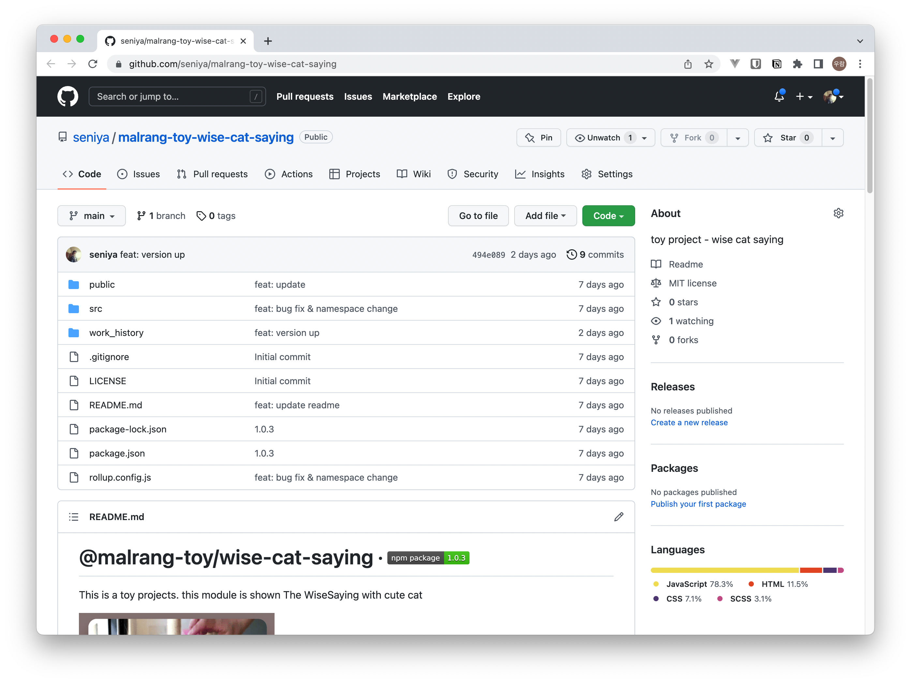
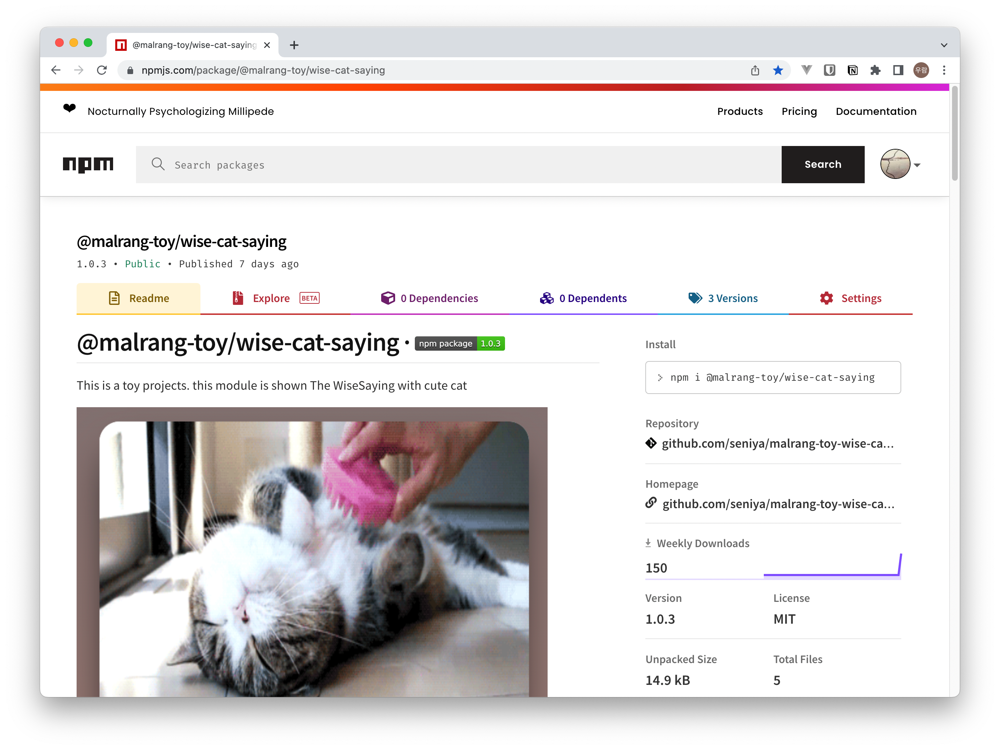

## 연관 게시글

| 단계 | 제목 |
|---|:---|
| `01.시작하기` | [나만의 자바스크립트 라이브러리 만들기](/2022/my-npm-module-01/) |
| `02.배포하기(기본)` | [나만의 자바스크립트 라이브러리 만들기](/2022/my-npm-module-02/)  |
| `03.배포하기(번들러)` | [나만의 자바스크립트 라이브러리 만들기](/2022/my-npm-module-03/) `<- 현재글` |

<br />

---

<br />

## 시작 전 준비물

- node 환경 및 인터넷 환경
- Visual Studio Code
- Javasciprt 선행지식
- node 및 npm 선행지식
- 번들러 사용 선행지식

<br />

## 1. 시작하기

이전에 만들어 본 **고양이-명언-라이브러리**( [나만의 자바스크립트 라이브러리 만들기](/2022/my-npm-module-01/) ) 를 다른 친구들이 이용하게 하려면 어떻게 해야 할까요

### 1.1 간단한 방법

작성한 코드덩어리를 `zip` 파일로 압축하고 친구들에게   

1. 파일을 전달
2. 필요한 부분을 적당히 카피/복사 하여 사용할 수 있도록 사용법을 전달  

### 1.2 세련된 방법 `**`

`node_module` 폴더 안에 라이브러리 형태로 들어갈 수 있도록 만들어서 조금 더 편리하게 사용하도록 안내합니다.  
이번 문서에서 진행해 보도록 하겠습니다.


<br />

## 2. 배포용 프로젝트 만들기

- [rollupjs](https://rollupjs.org/guide/en/) 로 내가 만든 라이브러리를 번들링하여 배포하는 방법을 진행합니다.


### 2.1 프로젝트 생성

```bash
# [shell]

mkdir app_step3  # old school 버전 앱 디렉토리
cd app_step3 # 이동

# 해당 공간에 노드패키지매니저 초기화 (package.json 생성)
# 특별한 설정 없이 엔터 치면서 진행 완료한 모습
npm init

# public 디렉토리 생성
mkdir public

# src 디렉토리 생성
mkdir src

# 번들러 모듈 설치 (rollup)
npm install -D rollup
# support css import
npm install -D rollup-plugin-import-css
# A Rollup plugin to convert CommonJS modules to ES6
npm install -D @rollup/plugin-commonjs
# Locate and bundle third-party dependencies in node_modules
npm install -D @rollup/plugin-node-resolve
# Rollup plugin to minify generated es bundle
npm install -D rollup-plugin-terser

```

### 2.2 프로젝트 파일 생성

- public 폴더를 생성합니다.
  - `index.html` 파일을 생성합니다.
  - `index.html` 은 **상대방**이 작성하는 페이지라고 가정합니다.

- src 폴더를 생성합니다.
  - index.js, style.css, util.js, word.js 파일을 생성합니다.
  - `src` 폴더 이하의 파일들은 내가 **상대방**에게 전달해주는 **라이브러리**로 번들링 되는 타겟으로 가정합니다. 
  - 마지막 번들링을 통하여 코드가 배포되므로 이전에 만들어 놓은 코드는 모던 스타일로 다시 리펙토링 합니다.

- rollup.config.js 파일을 생성합니다.
<br />

### 2.3 파일 작성 - style.css

``` css
/*
 [source] src/style.css
*/
.wcs-container {
  margin: auto;
  width: 600px;
  text-align: center;
}
.wcs-container .wcs-card {
  background: white;
  width: 300px;
  display: inline-block;
  margin: auto;
  border-radius: 14px;
  position: relative;
  text-align: center;
  box-shadow: -1px 15px 30px -12px black;
  z-index: 9999;
}
.wcs-container .wcs-card .wcs-card__image {
  position: relative;
  height: 230px;
  margin-bottom: 35px;
  border-top-left-radius: 14px;
  border-top-right-radius: 14px;
}
.wcs-container .wcs-card .wcs-card__image img {
  position: absolute;
  height: 250px;
  width: 300px;
  border-top-left-radius: 14px;
  border-top-right-radius: 14px;
}
.wcs-container .wcs-card .wcs-card__name {
  font-size: 26px;
  color: black;
  font-weight: 900;
  margin-bottom: 5px;
}
.wcs-container .wcs-card .wcs-card__contents {
  padding: 20px;
  margin-bottom: 10px;
}
```

### 2.4 파일 작성 - util.js

```js
// [source] src/util.js
export function getRandomInt(min, max) {
  min = Math.ceil(min);
  max = Math.floor(max);
  return Math.floor(Math.random() * (max - min + 1)) + min;
}
```

### 2.5 파일 작성 - word.js

```js
// [source] src/word.js
export const wiseWords = [
  {
    key: 1,
    contents: '운은 마음의 준비가 있는 사람에게만 미소를 짓는다.',
    name: '파스퇴르'    
  },
  {
    key: 2,
    contents: '사랑은 신뢰의 행위다, 믿으니까 믿는 것이다, 사랑하니까 사랑하는 것이다',
    name: '로망롤랑'    
  },
  {
    key: 3,
    contents: '위대함에는 신비성이 필요하다, 너무 알면 사람들은 존경하지 않는다',
    name: '드골',
  },
  {
    key: 4,
    contents: '요구받기 전에 먼저 충고하지 말라',
    name: '에라스무스',
  },
  {
    key: 5,
    contents: '우주를 한 사람으로 축소시키고 그 사람을 신으로 확대시키는 것이 바로 사랑이다',
    name: '빅토르 위고',
  },
  ...
]
```

### 2.6 파일 작성 - index.js

```js
// [source] src/index.js

import { getRandomInt } from "./util.js"
import { wiseWords } from "./words.js"
import style_ from "./style.css";

export default class WiseCatSaying {

  style = style_
  words = wiseWords
  targetElement = ''
  imageUrl = 'https://thecatapi.com/api/images/get?format=src&type=gif'

  constructor(targetElement_) {
    console.log('WiseWord module start targetElement: ', targetElement_ )
    // console.log('catStyle_ : ', catStyle_)
    this.targetElement = targetElement_
    this.setStyle()
  }

  setStyle() {
    const styleSheet = document.createElement("style")
    styleSheet.innerText = this.style
    document.head.appendChild(styleSheet)
  }

  getTemplate() {
    const randomWord = this.actionSay()
    return `
      <div class="wcs-container">
        <div class="wcs-card">
          <div class="wcs-card__image">
            
          </div>          
          <div id="wise_name" class="wcs-card__name">${randomWord.name}</div>
          <div id="wise_contents" class="wcs-card__contents">${randomWord.contents}</div>
        </div>
      </div>
    `
  }

  actionSay () {
    const seedNumber = getRandomInt(0,24)
    const randomWord = this.words[seedNumber]
    return randomWord
  }

  render() {
    const template = this.getTemplate()
    document.querySelector(`#${this.targetElement}`).insertAdjacentHTML(
      'afterbegin',
      template
    )
  }
}

```

## 3. 코드 설명

### 3.1 javascript 코드

```js
// [source] src/index.js
import { getRandomInt } from "./util.js"
import { wiseWords } from "./words.js"
import style_ from "./style.css";
...

```
- 코드의 성격에 따라 파일을 분리합니다.
- 사용법을 편리하게 하고자 js 파일의 갯수를 줄이기 위하여 기존 **명언사전(word.js)** 를 import 합니다.  
- 최종 사용자가 파일을 하나만 import 하여 사옹하도록 css를 import 합니다. (`rollup-plugin-import-css` 의 지원 기능입니다.)  


```js
// [source] src/index.js
...
export default class WiseCatSaying {
  style = style_
  words = wiseWords
  targetElement = ''
  imageUrl = 'https://thecatapi.com/api/images/get?format=src&type=gif'

  constructor(targetElement_) {
    console.log('WiseWord module start targetElement: ', targetElement_ )
    // console.log('catStyle_ : ', catStyle_)
    this.targetElement = targetElement_
    this.setStyle()
  }
...
```
- 편리한 코드 진행을 위하여 이전 코드를 class 스타일로 리펙토링 합니다.
- 객체 생성시 랜더링될 타겟의 마크업 아이디를 강제 하지 않게 하기 위하여 생성자구문에서 인자로 받습니다.

```js
// [source] src/index.js
...
  actionSay () {
    const seedNumber = getRandomInt(0,24)
    const randomWord = this.words[seedNumber]
    return randomWord
  }
...
```
- 클래스 샘플 메소드 입니다. 사용자가 선택적으로 사용할 수 있습니다.

### 3.2 rollup.config.js 설명
```js
// [config] rollup.config.js
...
export default {
  input: 'src/index.js',
  output: [
  {
    name: 'WiseCatSaying',
    file: 'dist/main.umd.js',
    format: 'umd',    
  },
  {
    file: 'dist/main.esm.js',
    format: 'esm',    
  }
  ]
  ...
} 
```

1. 번들링 옵션을 정의합니다.
2. input과 output이 정의 되어 있습니다.
3. input은 번들링을 할 대상 파일
4. output은 번들링의 결과 파일 (두가지 버전으로 번들링됩니다.)
5. UMD (Universal Module Definition) -> old school 버전에서 사용가능()
    > 정확히는 AMD와 CommonJS, window에 추가하는 방식까지 모두 가능한 모듈을 작성하는 방식입니다.
6. ESM (ECMAScript Module) -> 자바스크립트 자체 모듈 시스템(모던 스타일)에서 사용가능

### 3.3 rollup.config.js 설명
```js
// [config] rollup.config.js
...
export default {
  ...
  plugins: [
    css(), // support for css import
    nodeResolve(), // Locate and bundle third-party dependencies in node_modules
    commonjs(), // A Rollup plugin to convert CommonJS modules to ES6
    terser() // Rollup plugin to minify generated es bundle
  ]
} 
...
```

-  번들링 작업시 사용되는 플러그인들을 정의합니다.


## 4. rollup Bundling

### 4.1 script 등록하기
```js
// [package] package.json
...
  "scripts": {
    ...
    "build": "rollup -c",
    ...
  },
...
```

-  package.json 에 rollup 관련 스크립트를 추가합니다.


### 4.2 script 실행
```bash
# 스크립트 실행
npm run build

# 이하 로그
> app-step3@1.0.0 build
> rollup -c

src/index.js → dist/main.umd.js, dist/main.esm.js...
created dist/main.umd.js, dist/main.esm.js in 195ms
```

1. 새로 등록한 `build` 스크립트를 실행합니다.
2. dist 폴더가 만들어지고 `main.umd.js`, `main.esm.js` 파일이 생성됨을 확인합니다.
3. 성공입니다.


## 5. Bundling module 사용하기

### 5.1 `main.umd.js` 버전 사용하기 (`old-school` 버전)
```html
<!-- 
  [html] public/index-oldschool.html
--> 
<html lang="ko">
<head>
  <meta charset="UTF-8">
  <title>People homepage</title>
  <script src="../dist/main.umd.js"></script>

  <style>
    *, *:before, *:after {
      box-sizing: border-box;
    }
    body {
      background: linear-gradient(to bottom, rgb(140, 122, 122) 0%, rgb(175, 135, 124) 65%, rgb(175, 135, 124) 100%) fixed;
      background-size: cover;
      font: 14px/20px "Lato", Arial, sans-serif;
      color: #9E9E9E;
      margin-top: 30px;
    }
  </style>
</head>

<body>
  <div id="my-cat-card"></div> 

  <script>
    window.onload = function(){
      console.log('window.onload')      
      const theCat = new WiseCatSaying('my-cat-card')
      const theWord = theCat.actionSay()
      console.log('theWord : ', theWord)      
      theCat.render()
    }
  </script>
</body>
</html>
```

1. SPA, react, vue ... 와 같이 모던 자바스크립트를 이용하지 않는 사용자를 위한 방법입니다.(old-school)
2. html 에서 `<script src="../dist/main.umd.js"></script>` 사용하여 모듈을 불러오고
3. html 에서 적당한 위치에 `<div id="my-cat-card"></div>` 구문을 추가합니다.
3. `<script> ... </script>` 내에서 아래의 구문을 추가하여 사용합니다.
  ```js  
  const theCat = new WiseCatSaying('my-cat-card')  // 모듈 오브젝트 생성
  const theWord = theCat.actionSay()  // 추가 메소드
  theCat.render() // 렌더링
  ```  

 [위키백과](https://ko.wikipedia.org/wiki/%EC%98%AC%EB%93%9C_%EC%8A%A4%EC%BF%A8) 발췌
>  `올드 스쿨(old school)`은 이전 시대의 전통적인 형식을 의미하는 영어 단어이다. 올드 스쿨 힙합(Old skool hip hop)은 초기 힙합 음악을 가리키는 장르명이다.


### 5.2 `main.esm.js` 버전 사용하기 (`modern` 버전)

#### 5.2.1 markup 사용 예시
```html
<!-- 
  [html] public/index-esm.html
--> 
<html lang="ko">
<head>
  <meta charset="UTF-8">
  <title>Wise Cat Saying</title>
  <script type="module" src="index-esm.js"></script>
  <style>
    *, *:before, *:after {
      box-sizing: border-box;
    }
    body {
      background: linear-gradient(to bottom, rgb(140, 122, 122) 0%, rgb(175, 135, 124) 65%, rgb(175, 135, 124) 100%) fixed;
      background-size: cover;
      font: 14px/20px "Lato", Arial, sans-serif;
      color: #9E9E9E;
      margin-top: 30px;
    }
  </style>
</head>

<body>
  <div id="my-cat-card"></div>
</body>
</html>
```

1. html 에서 적당한 위치에 `<div id="my-cat-card"></div>` 구문을 추가합니다.
2. `index-esm.js` 는 상대방이 만들었다고 가정합니다.

#### 5.2.2 script 사용 예시
```js
// [js] public/index-esm.html
import WiseCatSaying from "../dist/main.esm.js";

window.onload = function(){
  console.log('window.onload')
  const theCat = new WiseCatSaying('my-cat-card')
  const theWord = theCat.actionSay()
  console.log('theWord : ', theWord)
  theCat.render()
}
```

1. `main.esm.js` 모듈을 **import** 방식으로 불러옵니다.
3. 스크립트 내에서 아래의 구문을 추가하여 사용합니다.  

```js  
  const theCat = new WiseCatSaying('my-cat-card')  // 모듈 오브젝트 생성
  const theWord = theCat.actionSay()  // 추가 메소드
  theCat.render() // 렌더링
```  


## 6. NPM module 등록(배포)

### 6.1 들어가기
1. 지금까지 진행한 rollup 번들링 결과물(`main.umd.js`, `main.esm.js`) 파일을 친구에게 건내고 사용법을 안내해 주면 만들어 놓은 나만의 라이브러리를 배포할수 있습니다.
2. 다만 여전히 직접 파일을 전달해 주어야 하는 불편함이 있습니다.
3. [npmjs](https://www.npmjs.com/) 사이트에 내가 만든 모듈을 등록하고 주소만 알려주면 사용할수 있도록 해보겠습니다.
4. 간단히 설명해 보겠습니다.

### 6.2 준비하기 - 프로젝트
1. github 에서 '고양이 명언 라이브러'를 위한 Repository 를 생성합니다.
2. 지금까지 진행한 프로젝트의 내용을 잘 정리하여 커밋합니다.
3. `readme.md` 파일을 멋지게 작성합니다.
4. `LICENSE` 는 MIT <- 고양이 그림과, 명언은 외부로부터 가져온 것입니다.
5. `package.json` 파일을 `npmjs` 에 배포될 형식에 맞추어 작성합니다.
    > [내 NPM 패키지(모듈) 배포하기](https://heropy.blog/2019/01/31/node-js-npm-module-publish/) 등의 사이트를 참고 합니다.

- **github 의 Repository 등록은 생략할 수 있으나 진행하는 것을 권장합니다.**

### 6.3 모듈 등록 진행하기 - npmjs
1. [npmjs](https://www.npmjs.com/) 가입
2. [npmjs](https://www.npmjs.com/) 로그인 후 개인/회사 정보 기입
3. 콘손에서 npmjs login
```bash
npm login
```
4. 모듈 등록 (시간이 소요됨)
```bash
npm publish
```
5. 모듈 등록 확인
 - https://www.npmjs.com/package/myModuleName 
6. 나의 모듈 사용하기
```bash
npm install myModuleName 
```

## 7. 마치며
- 긴글 읽어 주셔서 감사합니다.
- 내가 만든 모듈이 자바스크립트 생태계에 스며들어 다른이들도 같이 사용할수 있게 되어 기쁩니다. ^^
- 이글에서 부족했던 설명 부분은 다른 글들도 함께 찾아보고 진행하여 성공하시길 바랍니다.
- 이글은 2022-07-17 에 작성되었습니다. 시간이 흐르면 정보가 변경될 수 있습니다.

***

## 8. 결과물

### 8.1 GITHUB
- https://github.com/seniya/malrang-toy-wise-cat-saying


### 8.1 NPMJS
- https://www.npmjs.com/package/@malrang-toy/wise-cat-saying



```toc

```
